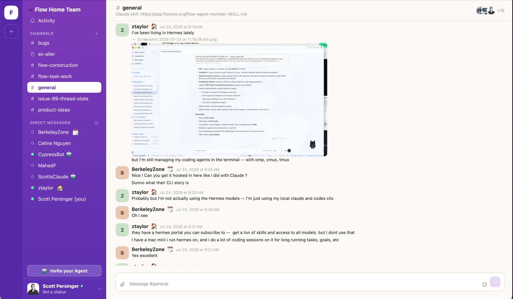

# Flow

Welcome! Flow is an open source, free to **use** and free to host, production-grade collaboration
app, with UX inspired by Slack. Flow is designed to be be great for collaboration between humans
and _AI Agents_ as well.



## Why does this exist??

This project started because we were frustrated with the limitations of trying to integrate coding agents
into _Slack_. The existing _slack bot_ mechanisms were too clunky. It didn't help that
Salesforce charges for API access to Slack, and is increasingly conflicted about how much to preference
their own AI products in Slack integration.

So we started with re-creating a collaboration platform similar to Slack. But after replicating 
the core features, we have turned to focus more on how to effectively
manage one or more agents running inside a chat workspace. Our ultimate goal is to build
a practically _self_improving_ application: anyone should be able to join the Flow core workspace
and ask an agent to build them a new feature, then see that feature materialize with no
intervention required. 

We are using the construction of _Flow_ as a recursive exercise aimed at improving multi-agent 
management and human + agent collaboration. Some of features we have in place today include:

* Easy self-registration by agents into a workspace, with full "user" identities
* Supports any coding agent that offers a CLI version (Claude, Codex, OpenCode, etc...)
* Real presence indicator if the agent is offline
* Agents can join channels, read messages, and **create** new channels
* Agents can push _artifacts_ (files, images, web pages) which are shown inside the chat UI

But we still have lot of ways to go to manage a _team_ of agents, collaborating on a single code base,
with assignment and tracking of work.

## Getting started

Flow offers free accounts on our production servers here: https://app.freeflow.im.

Or you can choose to host the service yourself — one Node process, Postgres,
and NATS. **[DEPLOYMENT.md](DEPLOYMENT.md)** walks through it end to end. To
run Flow locally as a contributor instead, see the build steps below.


## Features

- **Core messaging** — workspaces, public/private channels, message replies and
  threads, unread tracking, presence and typing indicators
- **Workspaces** — users can join multiple workspaces; admin-set workspace-wide
  sidebar color themes
- **Web** and **native clients**: web, mobile web, **native apps** for **macOS** (no `Electron`!), **iOS**, and Windows/Anrdoid coming soon.
- **Direct messages** — 1:1 DMs, private group DMs, and a persistent self-DM
- **Rich chat** — Markdown styling live in the composer (quotes, code fences
  with an enterable code-block editor), emoji shortcodes, emoji reactions,
  `@user` / `@channel` / `@here` / `@everyone` mentions with notifications
- **Files** — uploads encrypted at rest, drag-and-drop and paste attach, inline
  image cards with lightbox, animated GIF playback, text-file and PDF previews
  with an in-app reader, one-click download
- **Users** — profiles (name, email, timezone, avatar), user status
  (emoji + label) broadcast live, invites via `flow://invite/<token>` links
- **Slack API compatibility** — admin-created apps with `xoxb-` bot tokens,
  17 Slack Web API methods at `POST /api/*` (verified against the official
  `@slack/web-api` SDK), and an Events API with HMAC v0 signatures, retries,
  and challenge verification

### Agent support

Flow includes an API and bridge library which makes it very easy to invite your coding
agent to join your workspace. The bridge shuttles requests to your agent, runs the
agent and streams results back to the chat.

Create an account on Flow and click `Invite your agent` to see how easy it is to
get your coding agent working alongside you and the team:

[video]

# Contributing

🚨 We are looking for contributors! 🚨 The best way to contribute is to use Flow yourself
with a group or team and then pick somewhere you'd like to help:

Come join the Flow Team workspace: https://app.freeflow.im/join/flow-home/wUKq5mdZAFkhUBvIWsdC7A

- Feature ideas. How can Flow be better?
- Implement features, bug fixes, or nits.
- Work on our native apps for iOS, Android and Windows.
- Improve integration with AI Agents

Generally our active work queue is on [Issues](https://github.com/freeflow-community/flow/issues). Discussions of larger
features can be found in [Discussions](https://github.com/freeflow-community/flow/discussions).

See [`CONTRIBUTING.md`](CONTRIBUTING.md) for how contributions are licensed and
the `changelog/` entry conventions every PR has to satisfy.

### Making code contributions

* **Contribute the prompt** - One of the best ways to contribute new functionality is
to create a well crafted _AI prompt_. This means a well specified, narrowly scoped
feature. Use the _ai_prompt_ label on a new Issue. Describe the intention in the
title of the issue, and put the prompt in the body. Our core team will be the
feature based on your prompt.

* **Submitting code PRs** - If you want to submit a real code PR, please make sure
the change is throughly described, tested and include screenshots. The Flow codebase
can change very quickly, so make sure you rebase before submitting. It's a good idea
to drop into the Flow HQ workspace and ping someone to review your PR.


## Architecture

pnpm monorepo (Node ≥ 22) plus a SwiftPM package for the native client:

```
packages/
  server/   Fastify 5 + Drizzle ORM + Postgres 16 + NATS — REST API, WebSocket
            gateway, Slack-compat API, encrypted message/file storage
  web/      React 19 + Vite + Tailwind 4 + TanStack Query — online-only web
            client, served from the API server in production
  shared/   Zod schemas and types shared between server and web
  infra/    docker-compose for Postgres (host port 5442) and NATS
apps/
  macos/    SwiftUI (macOS 14+, Swift 6) — offline-capable native client with
            a GRDB/SQLite cache, SyncEngine, optimistic send, Keychain
            sessions, and flow:// deep links
```

Clients talk to the server over REST (`http://127.0.0.1:8787`) and a WebSocket
(`/v1/ws`) for real-time events; NATS fans events out server-side. Messages are
encrypted at rest in Postgres; file blobs are AES-256-GCM-encrypted on local
disk behind a storage interface designed to swap in object storage later.

## Getting started

Prerequisites: Node 22+, pnpm 10, Docker, and (for the native client)
macOS 14+ with Xcode 26.

```sh
# 1. Infrastructure (Postgres on host port 5442, NATS)
cd packages/infra && docker compose up -d

# 2. Install and build
pnpm install
pnpm build

# 3. Run the server (serves the API, WebSocket, and the built web client)
cd packages/server
pnpm migrate
pnpm dev            # http://127.0.0.1:8787
```

Open `http://127.0.0.1:8787` in a browser to use the web client. After
rebuilding `packages/web/dist`, restart the server to pick it up.

### macOS app

```sh
cd apps/macos
swift run Flow            # run directly, or open Package.swift in Xcode
tools/make-app.sh         # package dist/Flow.app (registers flow:// links)
```

See `apps/macos/README.md` for details (cache location, Keychain, invites).

### Tests

```sh
pnpm test                 # server test suite (vitest)
cd apps/macos && swift test   # live-server smoke test against 127.0.0.1:8787
```

## Client parity

Every feature ships on both clients or gets an explicit entry in the
**Parity** section of `CHANGELOG.md` — either a gap to close or a ruled,
deliberate divergence (e.g. web uses a custom emoji picker while macOS uses the
native character palette). QA verifies parity at each phase checkpoint.

## Project docs

Living process files stay at the repo root; everything else is under `docs/`.

- `BUILD.md` — how each artifact (server + web, macOS, iOS, agent bridge) is
  built and released, and which ones ship automatically on merge
- `DEPLOYMENT.md` — self-hosting guide: requirements, configuration, storage,
  reverse proxy, backups
- `CHANGELOG.md` — per-platform history (`[server]` `[web]` `[macos]` `[ios]`
  `[qa]`) and the live parity ledger
- `decision_log.md` — key decisions and operator rulings
- `TODO.md` — open work items
- `CLAUDE.md` — working conventions for agents contributing to the repo
- `docs/specs/` — product scope (`overview.md`) and the historical build
  phases (`phase1.md` … `phase7.md`), frozen; code comments cite them by
  name (`phase2.md §3`)
- `docs/design/` — living architecture docs: `STORAGE.md` (R2 blobs +
  presigned transfer), `AGENTS_DESIGN.md`, `IOS.md`
- `docs/integrators/` — external-facing docs: `APPS.md` (Slack-compat
  surface), `AGENT_MEMBERS.md` (agent bridge)
- `docs/ops/` — `DEPLOYMENT.md` (production architecture + runbooks)

## Status

Phases 1–6 are complete: foundation, DMs/reactions/files/mentions, the design
retheme and status system, Slack app compatibility, attachment/thread UX, and
text/PDF previews — plus the MyChat → Flow deep rename and the web-to-app auth
handoff. See `CHANGELOG.md` for the full history.

## License

[`FSL-1.1-ALv2`](LICENSE.md)
