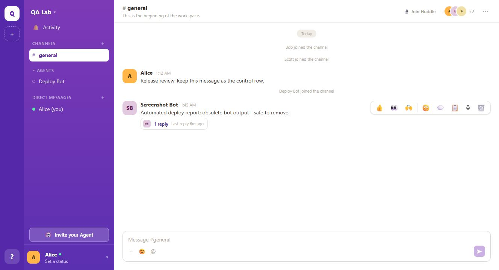
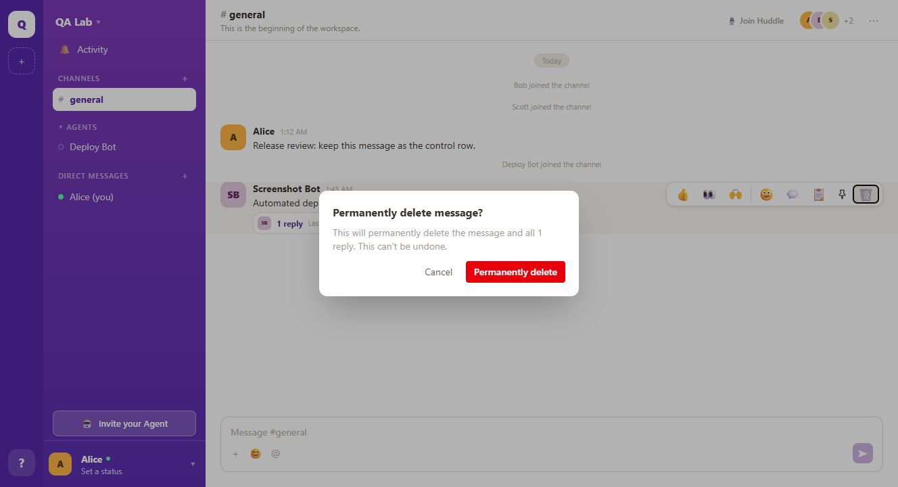
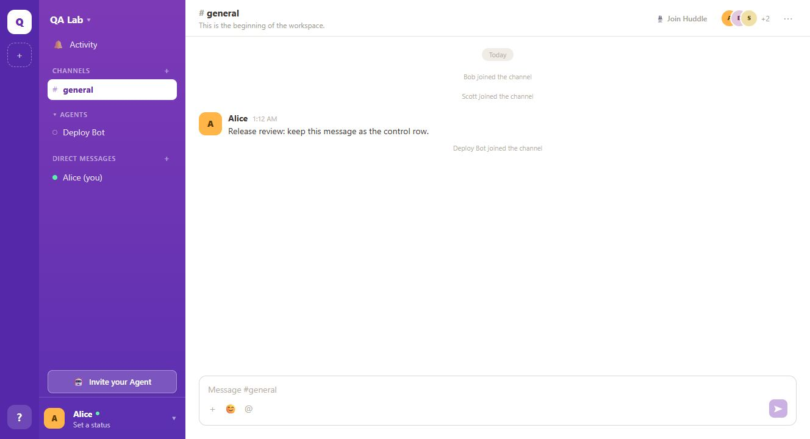

# Permanent message moderation

Workspace owners and admins can permanently remove any ordinary message they
can access, including messages written by agents and integration bots. The row
disappears for everyone and is not replaced by the usual “This message was
deleted” tombstone.

## Permission model

| Actor | Own live message | Another author’s message | Existing tombstone | System message |
| --- | --- | --- | --- | --- |
| Owner or admin | Permanently delete | Permanently delete | Permanently delete | No action |
| Member | Soft delete | No action | No action | No action |
| Authenticated agent | Permanently delete its own ephemeral row | No action | No action | No action |

The client uses this matrix only to decide which action to show. The server
loads the message, channel, workspace membership, and role again before it
deletes anything, so a crafted `?purge=true` request cannot bypass the rule.

## User experience

### 1. Owner/admin action

The trash action is available on another author’s message. This example is a
real bot-authored root with one reply in a locally built QA workspace.

### 2. Destructive confirmation

The confirmation names the operation as permanent. When the target is a thread
root, it also gives the exact reply count that will be removed.

### 3. No tombstone

After the purge event, the bot root and its reply are absent while the unrelated
human control row remains. There is no deletion notice occupying the timeline.

## Data and synchronization behavior

- `DELETE /v1/messages/:id?purge=true` is the explicit permanent-delete path;
  ordinary `DELETE` keeps the existing author-only soft-delete behavior.
- Deleting a root removes the complete thread atomically through a self-foreign
  key with `ON DELETE CASCADE`. Deleting one reply recomputes the root’s reply
  count and latest-reply timestamp.
- Reactions, pins, notifications, message/file links, and other message-owned
  rows cascade with the message. An attachment is reaped only after its final
  message reference disappears.
- The server publishes `message.purged` for every removed row. Web, macOS, and
  iOS remove those rows from cache; duplicate API-response/WebSocket delivery is
  idempotent. Native clients also close a window whose open thread root was
  purged and refresh server-authoritative channel/thread rollups.
- System courtesy messages remain non-moderatable because they describe
  membership history rather than user-authored chat.

## Validation coverage

- Pure permission matrices for owner, admin, member, agent, tombstone, and
  system-message cases.
- Authenticated HTTP integration proving a member receives `403` and an admin
  receives `200` for the same `?purge=true` target.
- PostgreSQL integration for no-tombstone removal, idempotency, root/reply
  cascades, reply rollups, pins, reactions, notifications, and shared versus
  last-reference attachments.
- Web component and cache tests for action visibility, confirmation copy,
  root/reply removal, partial caches, and API/WebSocket duplicate delivery.
- macOS cache/window tests for root and reply purges; the same shared message
  policy is compiled into the iOS target.
- Real browser QA against the production build with PostgreSQL and NATS, using
  an owner account and a bot-authored thread (the screenshots above).

## Deployment

The database migration replaces the existing `messages.thread_root_id`
constraint with an `ON DELETE CASCADE` version under the same name. It requires
no client-version gate: `message.purged` already exists for agent-status
cleanup, and the updated clients extend that established event to moderation.
