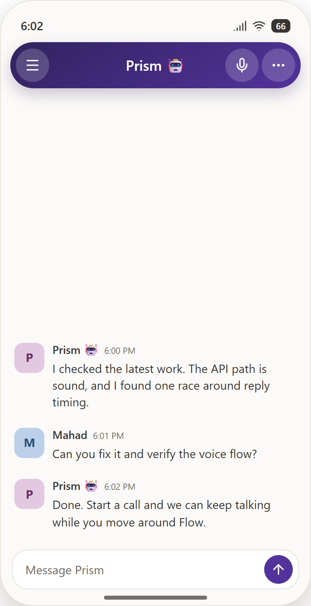
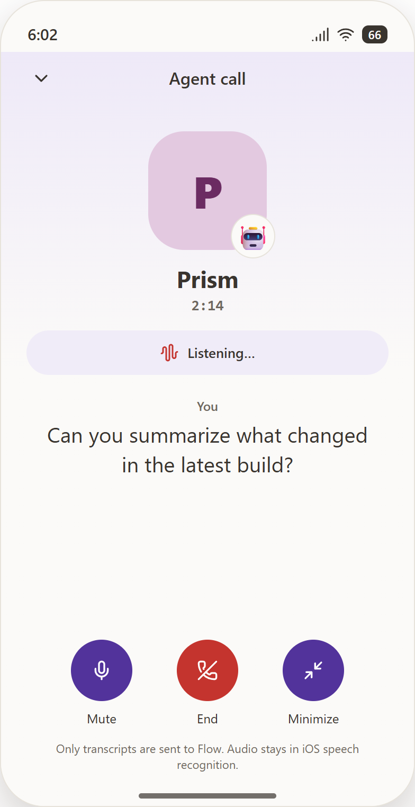
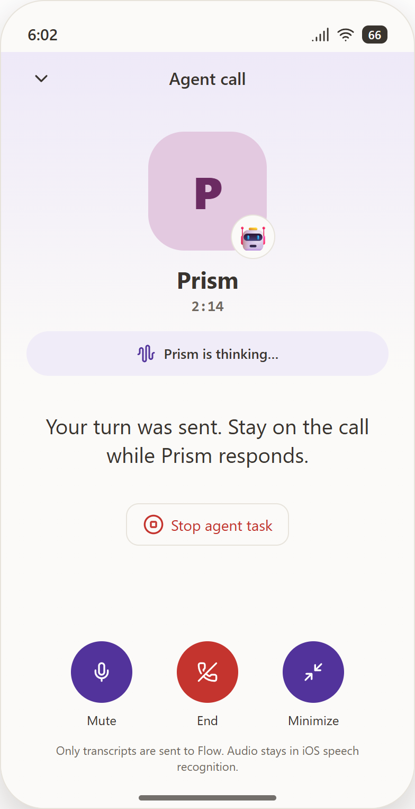
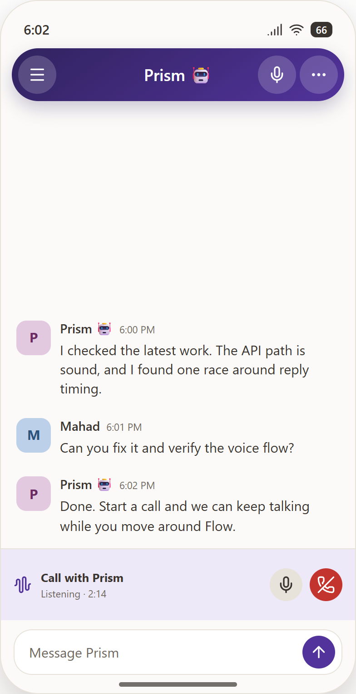

# Ongoing agent-call interaction

The iPhone agent call deliberately follows Flow's existing huddle lifecycle:
one app-level session, a persistent minimized bar, and an explicit end action.
Unlike a LiveKit huddle, its turns remain ordinary messages in the agent DM.

These rendered interaction references cover the states exercised by the UI
harness. XCUITest also attaches real simulator captures when run on macOS.

## Entry point

In a one-to-one agent DM, the existing huddle control becomes the call entry
point; ordinary channels and human DMs keep the existing LiveKit behavior.

## Listening

There is no editable transcript or Send button. Recognized speech is a live
caption and a short pause sends the turn automatically.

## Agent working

The same call remains open while the normal in-chat agent run is active. Its
existing interrupt reaction is available without leaving the call.

## Spoken reply

The first durable agent answer after the sent turn is read aloud. Listening
restarts when playback ends; Skip reply moves there immediately.

## Minimized

Minimizing or navigating does not end the call. The bar returns to the agent
DM and expanded controls when opened, and the red phone control ends it.

