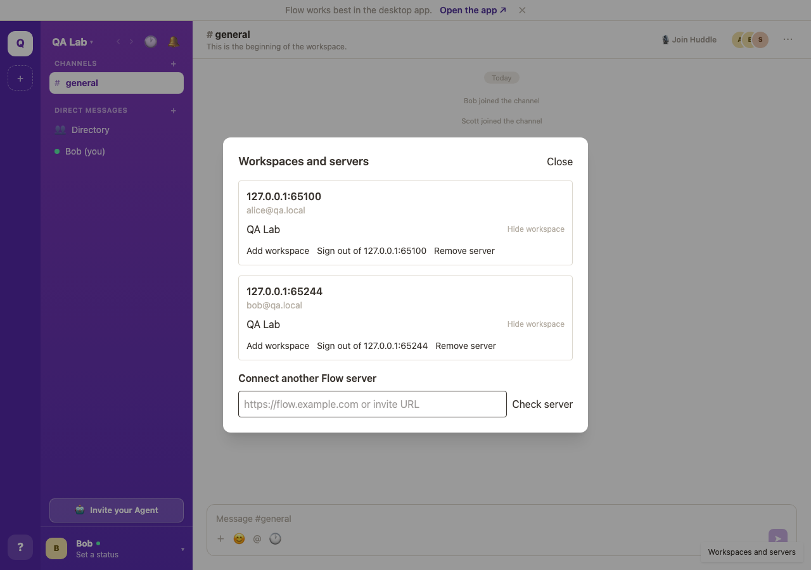
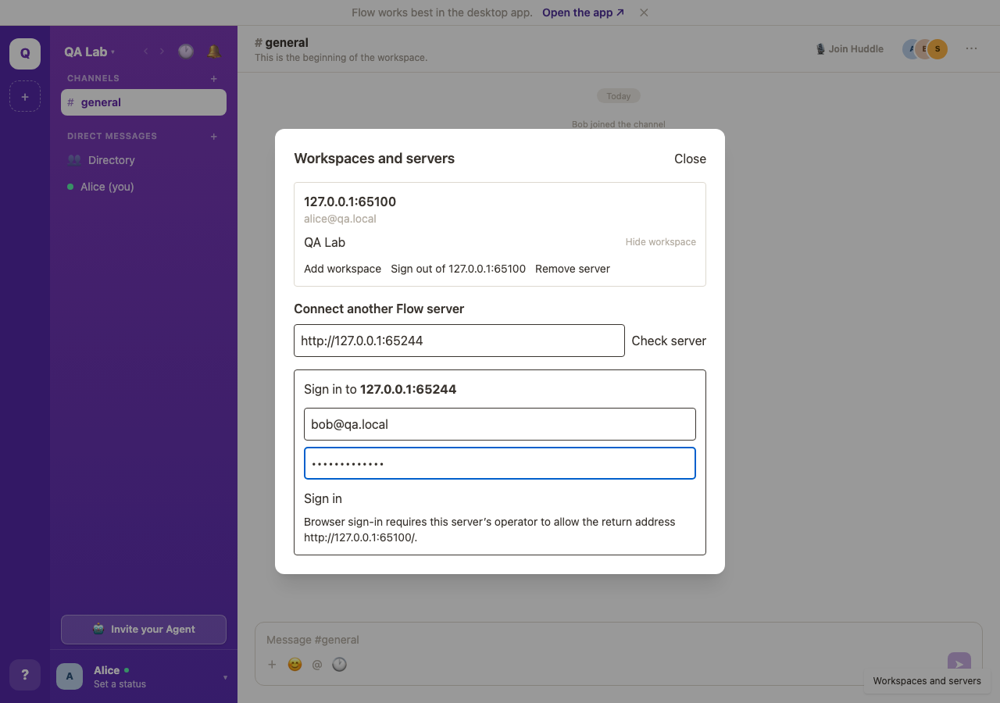
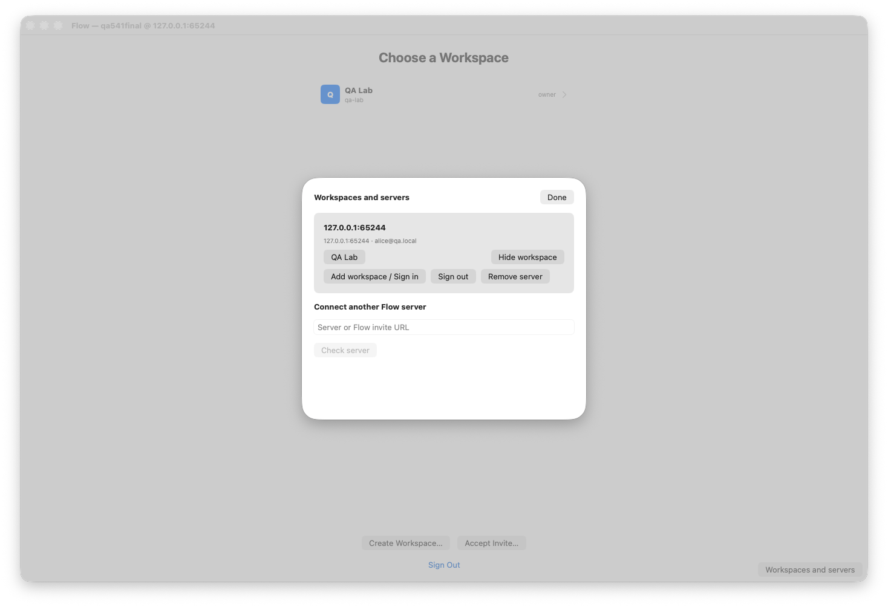

# Issue 541 verification

Verified on 2026-09-10 against two isolated QA backends using Alice and Bob, with identical workspace display names.

- Full `pnpm test`: web, server (837 tests), and bridge (322 tests) passed. Final web rerun: 489 tests passed.
- `pnpm -r build` passed.
- `scripts/check-clients.sh` compiled macOS and iOS.
- macOS `swift test`: 469 XCTest cases (two live-environment tests skipped), plus 31 Swift Testing cases passed.
- Playwright exercised destination disclosure before password entry, adding the second server, separate identities, duplicate workspace labels, independent tab drafts, reload restoration, hiding, and offline local sign-out without affecting the other tab. No browser errors.
- Native macOS connection sheet opened under an isolated QA profile. Native leave/delete confirmations name the account and server.
- Unit fixtures cover colliding identifiers, rejected discovery redirects, PKCE callback binding, stale authorization failures, identity rotation, scoped cleanup and late writes after disposal.

Provider sign-in requires operator-configured OAuth/email and allowed handoff destinations. The QA backends exercised password sign-in; callback protocol behavior is covered by unit tests. APNs delivery and the full failure matrix remain part of phase 4; compilation is not a substitute for those device checks.

