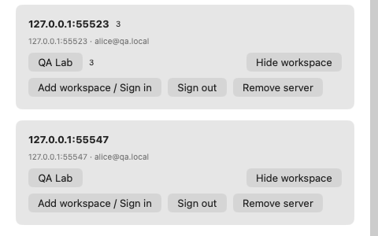
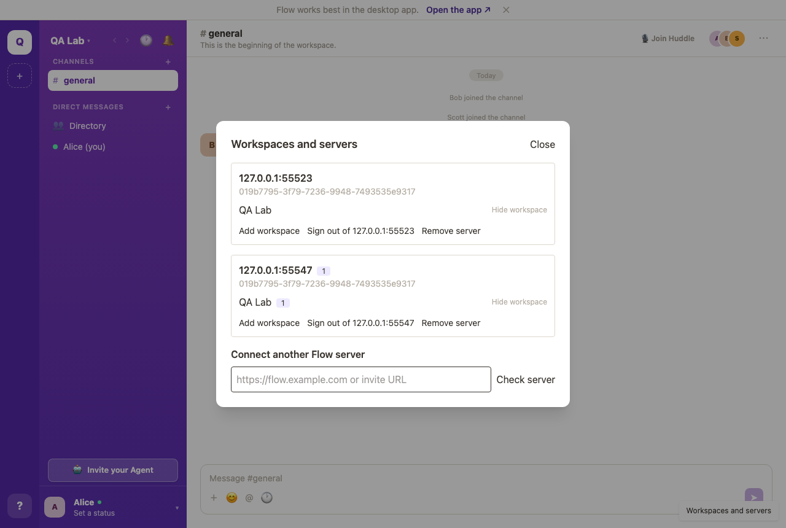
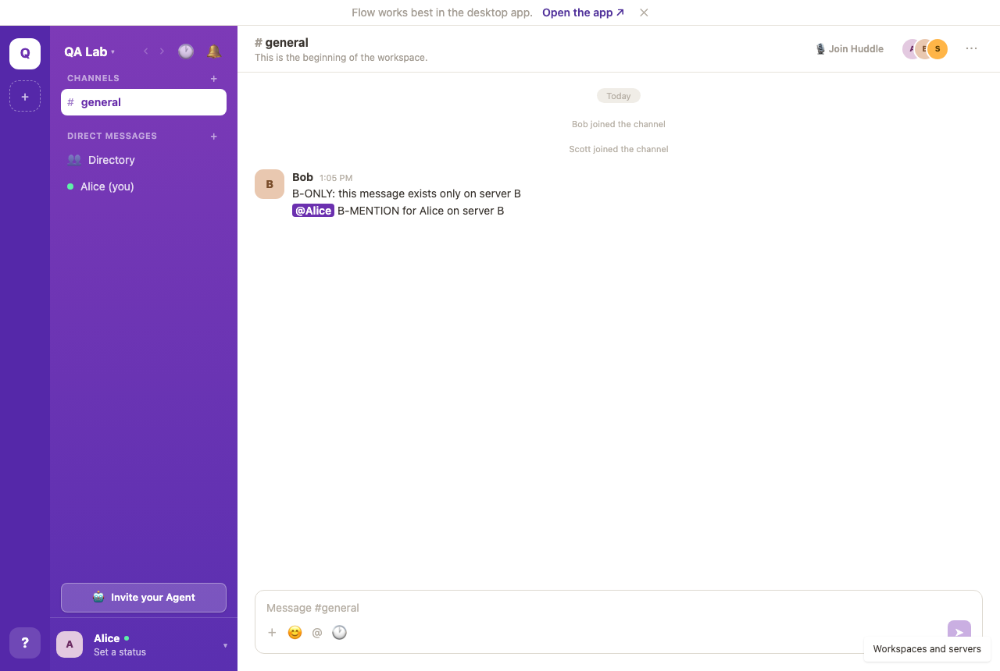

# Issue 542 verification — multi-server phase 4

Run on 2026-09-10 against **two independent QA backends with deliberately
overlapping user, workspace, channel and file ids** — the shape the spec's
acceptance section calls for, produced by:

```sh
pnpm qa:up --name=a --collide
pnpm qa:up --name=b --collide --allow-origin=<A's origin>
```

Both backends served identical `019b7756-…` workspace and `019b7b56-…` channel
ids to different data, so every isolation check below would have passed
vacuously against two ordinarily seeded servers.

## Verified by running it

**Web** — `docs/qa/issue-542/acceptance-web.mjs`, 10/10 checks, page served from
A, connecting to B:

- signed in on A, showing A-only content
- B's destination disclosed before any credential is typed
- the same email on both servers stays two separate accounts
- switching to B shows B and **zero** rows from A, despite identical ids
- 34 authenticated requests inspected: no bearer ever sent to the other backend
- a draft on B is absent from the same-id channel on A
- a mention on the server *not* on screen raised its switcher badge 0 → 1
- signing out of A left B signed in; A shows "sign in required"
- no uncaught browser errors

**macOS** — driven live under an isolated `FLOW_PROFILE`:

- added B from the connection sheet; destination disclosed before sign-in
- switching to B shows B-only content with A's colliding channel id
- three mentions on A while the window showed B: A held at 3 unread and the
  switcher badged "3 unread on this server" on the server that was off screen.
  Before the `isOnScreen` fix the same mentions were marked read within 22ms.

**iOS** — `scripts/push-sim.sh --event mention --state cold` delivered and
bannered on a freshly installed build (the legacy, unrouted path is unchanged);
a hand-built push carrying `routingId: "an-identifier-we-never-issued"` was
dropped with no banner and no badge write while the app was in the foreground.

**Suites** — `pnpm test`: web 509, server 841, bridge 332. `pnpm -r build`.
`scripts/check-clients.sh --tests`: macOS and iOS compile and pass.

## Reasoned about, not executed

State plainly rather than imply coverage:

- **Real APNs delivery with two routed registrations.** A simulator never gets
  a device token, so no connection can hold a real routing registration there.
  The routing rules (unknown identifier routes nowhere and mints nothing, a
  near-miss cannot inherit another connection's session, sign-out revokes only
  its own registration, removal revokes the route) are covered by
  `MultiServerSyncTests`; the badge-write ordering is a pure decision, also
  tested. The suspended-badge limitation is the spec's documented one.
- **Provider auth methods, invite links, replayed codes, registration-disabled
  backends.** The QA backends exercise password sign-in; provider sign-in needs
  operator-configured OAuth and allowlisted return destinations. Callback
  binding is covered by the phase-1/2 unit tests.
- **External storage uploads and presigned CORS.** The QA stacks store files
  locally, so there is no cross-origin storage host to exercise. The "bearer
  never leaves the exact origin" half is verified above.
- **Interrupted migration midway.** The migration is unchanged by this phase;
  its crash-safety is covered by the phase-2 tests.
- **Two native windows on different servers.** The `isOnScreen` model is
  per window and tested at the value level; the live check was one window.

## Environment note

Partway through the session the *packaged* `Flow.app` on this machine stopped
being able to open any socket — an unbundled build of the same commit connects
fine, as does a plain `URLSession` binary, so this is machine state and not a
code fault. The macOS checks above were driven with the SwiftPM executable,
which runs the same shared `AppState` / `SyncEngine` / `ConnectionManager`.






